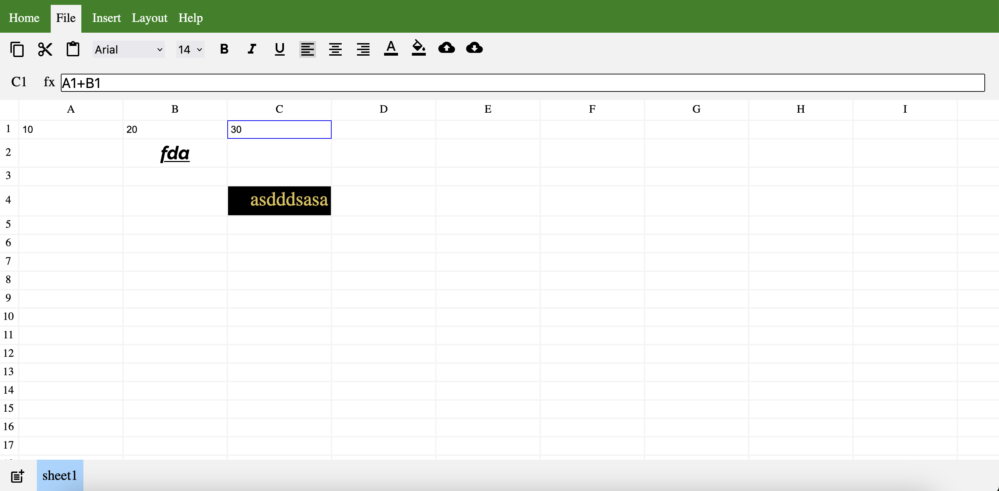

# Google Sheets Clone:

> A spreadsheet editing app build using Reactjs.

## Screenshot:

## Features:

1. Editing cells.
2. Applying styles to cells.
   1. Bold.
   2. Italic.
   3. Underline.
   4. Alignment (left, center, right)
   5. Font Family.
   6. Font Size.
   7. Color.
   8. Background Color.
   9. Uppercase
   10. Lowercase
   11. Trim
3. Creating and Editing multiple sheets.
4. Formula Evaluation.
   1. Dependent cell value change causes other cell which are dependent on this to update as well.
   2. Changing the cell contents of a cell directly removes the formula from the content cell directly.
   3. Formula Evaluation does not support unary operators. eg to do 10 _ (-20) write the formula as 10 _ (0 - 20) {unary '-' is not supported}
   4. Math functions supported -- SUM, AVERAGE, COUNT, MAX, MIN with range of cells like A1:B2 will have A1, A2, B1, B2
5. Conversion of sheets to json and reading from json.
6. Copying and Pasting of a Single Cell (including formula and styles if any)

#### Some Insights:

- Optimization:
  - A lot of optimizations were made to how each component should render so as to avoid re rendering of complete app whenever a single cell is being edited.
  - Multiple changes were made to how the state was being stored so as to make the optimizations.
  - React.memo was used to make sure re rendering is done properly and when required.
- CSS:
  - Flexbox is used heavily.
  - Some tricks involving opacity set to 0, to hide a component but make sure it's clickable etc were used to display icons for color changing.
- Using infix to postfix conversion and postfix evaluation to parse and evaluate the formula.
- DFS Cycle detection was used to detect if some formula is recursive in nature or not.

> Overall a good learning project.
